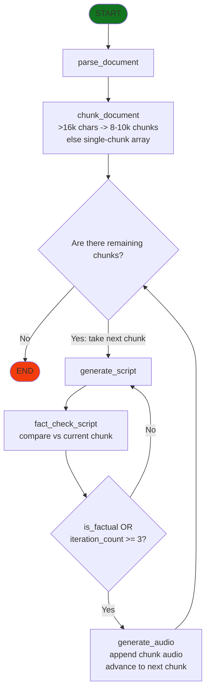

# Document to Audio

Ingests a PDF or DOCX, turns it into a podcast script via an LLM, fact-checks the
script against the source, and synthesizes the final audio — designed to run
entirely on free tiers and local models. The whole pipeline is orchestrated as a
LangGraph state machine, with long documents split into chunks and processed one
at a time.

## Stack

- **Orchestration:** LangGraph (open-source)
- **LLM (scriptwriter + fact-checker):** Gemini 3.1 Flash Lite
  (`gemini-3.1-flash-lite`) via Google AI Studio — generous free tier, 1M+ token
  context window so full documents fit in one prompt, and structured output for
  reliable fact-check results
- **Text-to-Speech:** Kokoro-82M via `pykokoro` (`KokoroPipeline` +
  `PipelineConfig` + `GenerationConfig`), run **locally on GPU**
  (`provider="cuda"`, `model_quality="fp32"`) with a blended voice
  (`af_nicole:0.5,af_bella:0.5`). `soundfile` + `numpy` concatenate the per-chunk
  segments into the final `.mp3`.
- **Parsing:** Docling — converts PDF/DOCX to structured Markdown, preserving
  headings, tables, and lists so the LLM receives well-formed input rather than
  flat text
- **Text splitting:** `langchain-text-splitters` (`RecursiveCharacterTextSplitter`)

## Setup

```bash
pip install langgraph langchain-google-genai langchain-text-splitters \
            docling pykokoro soundfile numpy pydantic python-dotenv
```

A free Google AI Studio API key is required. Set `GOOGLE_API_KEY` in a `.env`
file — it is loaded with `python-dotenv` and never hardcoded.

## Architecture

The pipeline operates on a single shared state (`PodcastState`) managed by a
LangGraph `StateGraph`. Every node reads from the state and returns a partial
dict of the fields it updates.

### Shared State (`PodcastState`)

| Field | Meaning |
|---|---|
| `document_path` | Input — path to the source `.pdf`/`.docx` |
| `document_name` | Input — base name for the output audio file |
| `document_text` | Markdown extracted from the document, headings/tables/lists preserved |
| `chunks` | Document split into processable pieces |
| `current_chunk_index` | Outer-loop pointer into `chunks` |
| `script` | Current chunk's draft podcast script |
| `feedback` | Fact-checker's critique, fed into the next rewrite |
| `is_factual` | Whether the current chunk's script passed the fact-check |
| `iteration_count` | Per-chunk rewrite count (reset between chunks; loop-cap key) |
| `audio_segments` | Accumulated per-chunk audio arrays |
| `audio_path` | Path to the final combined `.mp3` file (`{document_name}_podcast.mp3`) |
| `script_segments` | Accumulated per-chunk finalized scripts |

### Nodes

- **`parse_document_node`** — uses Docling to convert the document to Markdown
  (headings, tables, and lists preserved) and stores it in `document_text`
- **`chunk_document`** — if the document is ≤16k chars it becomes a single chunk;
  otherwise it is split into ~9k-char pieces with `RecursiveCharacterTextSplitter`.
  Also initialises the outer-loop state.
- **`generate_script`** — Gemini writes/rewrites the script for the current chunk,
  incorporating any prior `feedback`. Scripts carry no intros/outros — each chunk
  is one continuous section.
- **`fact_check_script`** — Gemini compares `script` against the source chunk via
  structured output; sets `is_factual`, writes `feedback`, increments
  `iteration_count`
- **`generate_audio`** — Kokoro synthesises the chunk's audio, appends it to
  `audio_segments`, and writes the running concatenation to `audio_path`. It also
  appends the finalized script to `script_segments` and writes the running text to
  `{document_name}_podcast_script.txt`. Finally it advances `current_chunk_index`
  and resets `iteration_count`/`feedback` for the next chunk.



### Control Loops

- **Inner (rewrite) loop** — after each fact-check, route back to `generate_script`
  unless `is_factual` is true **or** `iteration_count >= 3` (a hard cap per chunk
  that guards against infinite rewrite loops and runaway API usage)
- **Outer (chunk) loop** — after `generate_audio`, continue to the next chunk while
  `current_chunk_index < len(chunks)`, otherwise `END`

## Usage

The main file is [`doc-to-audio.py`](doc-to-audio.py); it builds the compiled
LangGraph `app` and ends with a run block that invokes it on a source document.
(The [`docx-to-audio.ipynb`](docx-to-audio.ipynb) notebook is **deprecated** — kept
only for reference.)

1. Ensure `GOOGLE_API_KEY` is set in your `.env` file.
2. Point `DOCUMENT_PATH` / `DOCUMENT_NAME` at your source document, then run the
   script.

When invoking the graph, provide:

- `document_path`: path to the source `.pdf` or `.docx`
- `document_name`: base name for the final output audio file

Parsing and chunking happen inside the graph, so only the path and name are
passed. Long documents produce many super-steps, so pass a raised
`config={"recursion_limit": ...}` (the default of 25 is easily hit):

```python
result = app.invoke(
    {"document_path": DOCUMENT_PATH, "document_name": DOCUMENT_NAME},
    config={"recursion_limit": 200},
)
```

This produces `{document_name}_podcast.mp3` and `{document_name}_podcast_script.txt`.

## Development Notes (For Contributors)

- **State management:** nodes read from `state` and return partial updates so
  LangGraph can merge them — do not mutate the state in place.
- **Loop integrity:** the outer loop relies on `generate_audio` advancing
  `current_chunk_index` and resetting `iteration_count`/`feedback`. Dropping these
  stalls the chunk loop or leaks critique between chunks.
- **Scripting contract:** the fact-check → rewrite contract is critical —
  `generate_script` *must* consume the `feedback` field for the inner loop to
  converge.
